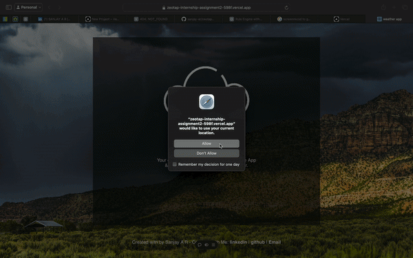

# Weather App

## Overview

A simple and user-friendly weather application that provides current weather information and forecasts.




## Deployed Application

[Weather App Live Demo] (https://zeotap-internship-assignment2-598f.vercel.app)

## Features

- Current weather conditions
- 5-day forecast
- Search for weather by city or zip code
- Temperature units toggle (Celsius/Fahrenheit)
- Responsive design for desktop and mobile devices

## Technologies Used

- HTML5
- CSS3
- JavaScript
- [Weather API Name] for weather data

## Installation

1. Clone the repository:
   ```
   git clone (https://github.com/sanjay-ar/zeotap-internship-assignment2)
   ```
2. Navigate to the project directory:
   ```
   cd weather-app
   ```
3. Open `index.html` in your preferred web browser.

## Usage

1. Enter a city name or zip code in the search bar.
2. Press the search button or hit Enter.
3. View the current weather and forecast for the specified location.
4. Toggle between Celsius and Fahrenheit using the temperature unit switch.

  


