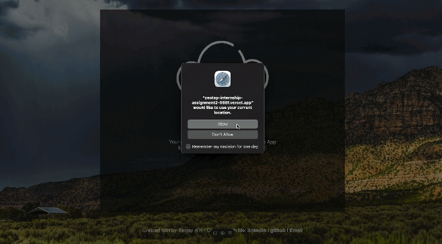

# Weather Monitoring System
This is a real-time system for processing and analyzing weather data from OpenWeatherMap API.

## Overview

A simple and user-friendly weather application that provides current weather information and forecasts.




## Deployed Application

[Weather App Live Demo] (https://zeotap-internship-assignment2-598f.vercel.app)

## Features

- Current weather conditions
- 5-day forecast
- Search for weather by city or zip code
- Temperature units toggle (Celsius/Fahrenheit)
- Responsive design for desktop and mobile devices

## Technologies Used

- HTML5
- CSS3
- JavaScript
- [Weather API Name] for weather data

## Installation

1. Clone the repository:
   ```
   git clone https://github.com/sanjay-ar/zeotap-internship-assignment2
   ```
2. Navigate to the project directory:
   ```
   cd zeotap-internship-assignment2
   
   ```
3. Setup

   ```
   npm i 

   npm start 
   
   ```
---

### 🚀 Maintained by [Sanjay A R](https://github.com/sanjay-ar)

[](https://portfolio-ar.vercel.app/)  
[](https://www.linkedin.com/in/sanjay-ar/)  
[](https://github.com/sanjay-ar)

> 💡 *Like this project? Leave a ⭐ and connect with me!*


